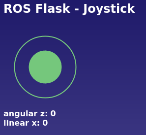

# ROS Flask

## joystick

A simple speed control program on the website using a joystick passes the speed value to ROS.



### How to run

    ``` roslaunch ros_flask flask_joystick.launch```

### Reference

    JoyStick Project - https://github.com/bobboteck/JoyStick